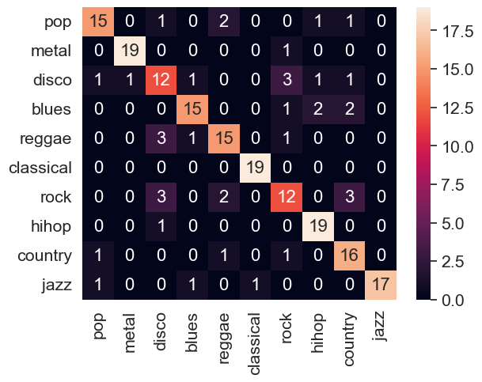

## Music genre classification via machine learning

  On the GTZAN dataset, we leverage an ensemble LSTM model to classify musics into the 10 dataset genres. Each sample is a set of features extracted by Librosa from a part of a music original file.

  - Results for tasks 1 to 3 are contained in their respective notebooks in the Code folder.
  - Results for task 4 are in Code/task4.ipynb ; preliminary results are also presented in Code/task4_*
  - The backbone functions for the notebooks are defined in Code/utills.py and Code/classifiers.py
  - The model can be tested using Code/run_best_predictor.py ; ensure that test data has the same shape as the used train data (5 seconds dataset)

    ### Final result :

    
